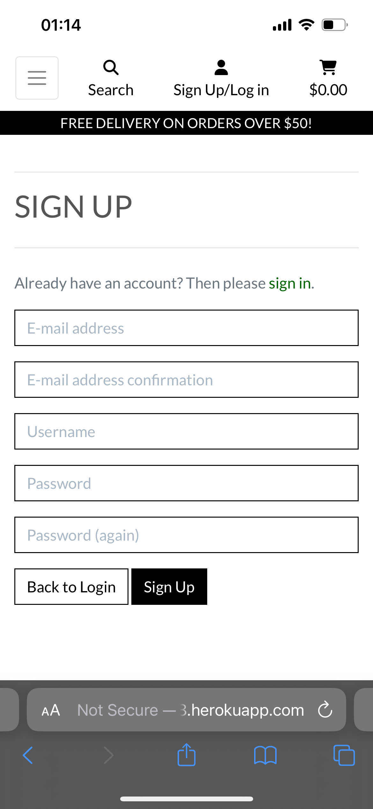
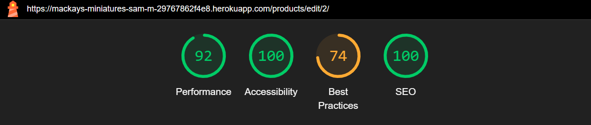
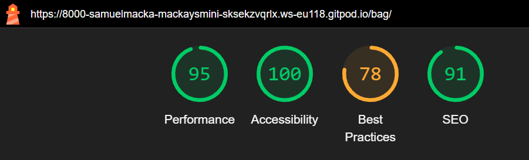
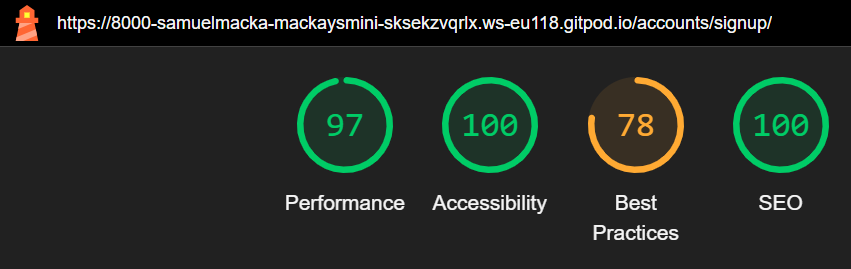

# Mackay's Miniatures
MacKay's Miniatures is a platform that sells and distributes Warhammer Miniatures, for warhammer 40,0000 and Age of Sigmar.
The website will have an easy navigate navbar, and search engine so you can find what you are looking for easily.
An account page will let the users save their details, delivery address and view their previous purchases.


2. [User Stories](#user-stories)
3. [Wire Frames](#wireframes)
4. [Features](#features)
5. [Testing](#testing)
6. [Bugs](#bugs)
7. [Deployment](#deployment)
8. [Credits](#credits)

## User Stories 
|Story No.|Story|
| ------------- | ------------- |
|1| As The Site Owner, <br> I want to be users to be able to find what they are looking for with ease <br> So they will be more likely to buy from me <br><br> I know I am done when I have an easy to use NavBar and an effective search engine that allows you to filter out specific items, a gallery style product page and a sorting system |

|2| As the Site Owner, <br> I want to have a site that has secure payment methods <br> So first time and repeat buyers feel comfortable purchasing from me, <br><br> I know I am done when I have a secure payment method that is reliable and looks professional |

|3| As the Site Owner, <br> I want to have an easily identifiable notification on all New Releases and Pre Order's <br> So potential customers can see what is the newest products and be excited by them <br><br> I know I am done when I have an icon that stands out and identifies the specific product as New or Pre-orderable.|

|4| As A Site user, <br> I want to have a highly understandable way of seeing the effects of my interactions with the site when registering an account, logging in, adding items to my cart, ETC. <br> So I am informed of any information that needs to be presented. <br><br> I know I am done when I have a notification system that will show any information like the above.|

|5| As A returning Customer , <br> I want to be able to see my previous purchases, save my delivery and payment details <br> So I can buy from the provider again with ease and without adding in all the info every time.  <br><br> I know I am done when I have an account system that when logged in will save the delivery address location auto fill. |

|6| As A potential buyer , <br> I want to be able to see whats in my shopping cart and be able to edit them, remove them or increase how many i want <br> So I don't have to navigate away from the buy page to edit what im buying <br><br> I know I am done when i have a page for displaying shopping bag contents and lets me edit what is in it.|

|7| As A buyer , <br> I want to be able to see my invoice information and have it emailed to me for confirmation <br> So I Know my purchase has worked and I have evidence of the products I should receive <br><br> I know I am done when I have set up an automatic email that will fill in with the buyers information and any contact information for them to be able to contact the owner.|

|8| As A Site user, <br> I want to be able to add new products, edit old products, have only admins be able to do it <br> So I can add new models when they are announced and released, and edit old ones if the information changes <br><br> I know I am done when I have a simple front end page that allows ONLY admin/superusers to make changes, remove and add models and images to the website.|

***

## Wireframes
Below are the designs that I can use to build the site. I have used the user story numbers to link where I can meet the goal in my design. This will help me to think about the users needs as I build the page.

### Home Page Design<br>
User Story Number 1 -  <br>


User Story Number 1 -  <br>


User Story Number 1,3 -  <br>


User Story Number 5,7 -  <br>


User Story Number 2,6 -  <br>


User Story Number 8 -  <br>


User Story Number 4 -  <br>


User Story Number 3,7 -  <br>

***

## Features

### Existing Features

- __Navigation Bar__

  - Links to all pages and is fixed to top
  - resizes for responsive mobile use
  - search bar to search for models
  - account button that links to profile and (for admin) product management
  - account button changes to sign in/sign up button when not logged in
  - a banner to show how much you need to spend for free delivery


- __Home page__

  - A powerful artwork that shows the theme and setting of some of the models available
  - links to start shopping as a big button 
  - call to action to tell you what the button does


- __Product page__

  - A display of models
  - allows adding to bag from product page
  - has indicator for if its new or pre-order
  - can sort alphabetically by setting, faction, name or price
  - can filter but using nav bar options to only show specific factions/settings


- __Manage Product Page__

  - A form that will add a product to the website
  - will only take valid inputs
  - can supply an image, otherwise a place holder will take over
  - is the same for edit and add, but edit will auto fill with product info


- __Profile Page__

  - Has a form to save delivery info to your account
  - shows a list of old orders and can open up their invoice pages
  - will auto fill the form with data from checkout if save info is checked
  - can update info at any time


- __Shopping Cart__

  - Has info for each model in cart
  - has a cost per model and a calculated total cost based on qty
  - can edit qty and remove any thing from the cart page
  - shows a warning sign for how far way from free shipping you are
  - shows a warning sign if any product is pre order with a tool tip attached
  - tells you current cost, delivery cost and adds it together for a grand total
  - cart icon on nav bar updates with current cost of cart


- __Check out__

  - a form that will only accept valid info for shipping info
  - a list summary of models in cart and total cost
  - an option to save your currently input information to your profile
  - a stripe secure payment method at will responsively update to any errors
  - a warning to say how much you will be charged
  - a quick back to cart button if you want to edit anything
  - the warning for pre order models will show here too


- __Invoice Page__

  - A notification of what email address the invoice has been sent to
  - All important information for the invoice will be displayed
  - if logged in with an account when making purchase, can return to this page to check on purchases
  - a toast of the order number and email will pop up too


- __NOTIFICATIONS__

- all useful info pop ups will show up like this


### Features Left to Implement

- 


## Testing

This is a sample of shots of what the site looks like on different devices. 

#### Desktop
|Firefox 128.0.2| Chrome 127.0.6533.72/73 / 23 July 2024|
| ------------- | ------------------ |
|||
|||
|||
|||
|||
|||
|||
|||
|||


| Firefox 128.0.2 medium & Chrome 127.0.6533.72/73 / 23 July 2024 medium |
||
||
||
||
||
||
||
||
||

#### Mobile

##### Safari iOS Phone 17.5
| iPhone home page |


| iPhone sign up page |


| iPhone sign in page |


| iPhone profile page |


| iPhone product page |


| iPhone product manage page |


| iPhone invoice page |


| iPhone cart page |

### Validator Testing
- HTML
    - home.html: No errors were returned when passing through the official W3C validator  |<br> 
    - add_product.html: No errors were returned when passing through the official W3C validator  |<br> 
    - edit_product.html: No errors were returned when passing through the official W3C validator  |<br> 
    - products.html: No errors were returned when passing through the official W3C validator  |<br> 
    - product_page.html: No errors were returned when passing through the official W3C validator  |<br>
    - shopping_cart.html: No errors were returned when passing through the official W3C validator  |<br> 
    - checkout.html: No errors were returned when passing through the official W3C validator  |<br> 
    - checkout_success.html: No errors were returned when passing through the official W3C validator  |<br> 
    - login.html: No errors were returned when passing through the official W3C validator  |<br> 
    - signup.html: No errors were returned when passing through the official W3C validator  |<br> 
    - profile.html: No errors were returned when passing through the official W3C validator  |<br> 
    - order_history.html: No errors were returned when passing through the official W3C validator  |<br>

- CSS 
    - base.css: No errors were returned when passing through official Jigsaw validator |<br> 
    - profile.css: No errors were returned when passing through official Jigsaw validator |<br> 
    - checkout.css: No errors were returned when passing through official Jigsaw validator |<br> 

- JS 
    - stripe_elements.js: No errors were returned when passing through official JSHint validator |<br> 

    - countryfield.js: No errors were returned when passing through official JSHint validator |<br> 
    
    - add_products.html built in js: No errors were returned when passing through official JSHint validator |<br> 

    - edit_products.html built in js: No errors were returned when passing through official JSHint validator |<br> 

    - checkout_html built in js: No errors were returned when passing through official JSHint validator |<br> 
    
    - bag_html built in js: No errors were returned when passing through official JSHint validator |<br> 

    - products_html built in js: No errors were returned when passing through official JSHint validator |<br> 

    - quantity_input.js: No errors were returned when passing through official JSHint validator |<br> 

- Python
    - app.py:  No errors were returned when passing through CI Python Linter <br>

- Lighthouse

  ### NOTE:
    - The light house is taking a score hit in best practices for cookie usage in a 3rd party programme that i do not have control over, as is the performance because of all the high quality images that are stored in AWS.
    - I have have done all the improvements with in my power to get the scores has high as possible
    - some of the crispy forms used (I.E. For the country selector) do not come with a built in label, which is tanking the accessability on some pages. and i cannot fix this issue
    
    - home.html: No errors were returned when passing through the Lighthouse validator |<br> 
    - add_product.html: No errors were returned when passing through the Lighthouse validator |<br> 
    - edit_product.html: No errors were returned when passing through the Lighthouse validator |<br> 
    - product_page.html: No errors were returned when passing through the Lighthouse validator |<br>
    - products.html: No errors were returned when passing through the Lighthouse validator |<br> 
    - shopping_cart.html: No errors were returned when passing through the Lighthouse validator |<br> 
    - checkout.html: No errors were returned when passing through the Lighthouse validator |<br> 
    - checkout_success.html: No errors were returned when passing through the Lighthouse validator |<br> 
    - login.html: No errors were returned when passing through the Lighthouse validator |<br> 
    - signup.html: No errors were returned when passing through the Lighthouse validator |<br> 
    - profile.html: No errors were returned when passing through the Lighthouse validator |<br> 
    - order_history.html: No errors were returned when passing through the Lighthouse validator |<br>

### Manual Testing
- I have tested that this page works in different web browsers by using chrome, safari and mozilla firefox on my computer and it is responsive on all platforms, looks consistent and no bugs with layouts or functions break.
- I have tested that the project is responsive and works with different device sizes by using the 'inspect' tool and resizing to various different device sizes to make sure the lay outs remained functioning, readable and appealing. I also used my iPhone 16 on safari to check for any anomalies and i found the shipping threshold banner was looking a little goofy. so after adding a media query It looks good and functions as normal. 
- I have tested all links, internal and external. I found I had missed a href for the mobile profile link, so the profile page wasn't working on mobile devices, after i fixed that They now all go to the correct destination and open in the correct way. 
- I have tested that all text and fonts are readable and easy to understand, along with color choices. I used a contrast checker website [contrast checker](https://webaim.org/resources/contrastchecker/) to find viable colors and used the lighthouse feature in the inspect tool to check it all worked out. I have also used a clean common font so it is usable on all, new and old, devices.
- I have asked my partner to use the website to see what a first time user would experience. She checked around the website to see how intuitive it was, how easy it was to understand and create an account, make a purchase and that it all worked well from a new pair of eyes.

### Bugs
#### Bug 1
- link to profile page was not working on mobile, had not added the link to both desktop and mobile navbars

Old code:
```
              
                   <a href="" class="dropdown-item">Product Management</a>
               
               <a href="" class="dropdown-item">My Profile</a>
               <a href="" class="dropdown-item">Logout</a>
           
               <a href="" class="dropdown-item">Sign Up</a>

```
New code:

```
              
                   <a href="" class="dropdown-item">Product Management</a>
               
               <a href="" class="dropdown-item">My Profile</a>
               <a href="" class="dropdown-item">Logout</a>
           
               <a href="" class="dropdown-item">Sign Up</a>

```

#### Bug 2
- email information was not displaying correctly, I had forgotten to add the jinja database info to the email_confirmation_body.txt

Old code:
```
Your order information is as below:
 
 Order Number: 
 Order Date: 
 Phone: 
 
 Order Total: £{{ order.order_total }}
 Delivery: £{{ order.delivery_cost }}
```
New code:

```
Your order information is as below:
 
 Order Number: {{ order.order_number}}
 Order Date: {{ order.date }}
 Phone: {{ order.phone_number }}
 
 Order Total: £{{ order.order_total }}
 Delivery: £{{ order.delivery_cost }}

```

#### Bug 3
- Both edit and add forms were not displaying the set image correctly, added more for statements in the html and some js to get it function as intended,the same changes were made to both add_product.html and edit_product.html.

Old html code:
```
<form method="POST" action="" class="form mb-2" enctype="multipart/form-data">
                     
                     {{ form | crispy }}
```
New html code:

```
<form method="POST" action="" class="form mb-2" enctype="multipart/form-data">
                     
                     
                         
                             {{ field | as_crispy_field }}
                         
                             {{ field }}
                         
                     
```


New js code:

```

     {{ block.super }}
     <script type="text/javascript">
         $('#new-image').change(function(){
             var file = $('#new-image')[0].files[0];
             $('#filename').text(`Image will be set to: ${file.name}`);
         });
     </script>
 
```

#### Bug 4
- heroku deployment wasn't working, and live emails were not sending, needed to fix the python version in the runtime.txt

Old code:
```
 python-3.12.2
 
```
New code:

```
 
 python-3.9.19

```  

#### Bug 5
- getting and error 500 message on sign in, caused by the default_full_name field not being a field in the UserProfile, changed it back to user and made the autofocus target default_phone_number

Old code:
```

         self.fields['default_full_name'].widget.attrs['autofocus'] = True

```
New code:

```

         self.fields['default_phone_number'].widget.attrs['autofocus'] = True

```

#### Bug 6
- I missed a typo on the confirm your order button
Old code:
```
<a href="" class="btn btn-black btn-block rounded-1">
                         <span class="text-uppercase">Confrim your order</span>
                     </a>

```
New code:

```
<a href="" class="btn btn-black btn-block rounded-1">
                         <span class="text-uppercase">Confirm your order</span>
                     </a>

```

#### Bug 7
- Had a sizing issue with the shipping threshold banner on devices smaller than 425px. added a media query to adjust it. found on my 1Phone

New code:
```
@media (max-width: 425px) {
    #shipping-threshold {
        font-size: 0.99rem;
    }
}
```

#### Bug 8
- mobile navbar was displaying wrong on devices smaller than
Old code:
```
                    <p class="my-0">My Account <small>({{ user.username }})</small></p>

                     </a>

```
New code:

```
                    <p class="my-0">My Account <small id="hide-on-sm">({{ user.username }})</small></p>


```
```
@media (max-width: 375px) {
    #hide-on-sm {
       display: none;
    }
}


```

### Unfixed Bugs
 - Lighthouse performance and best practices have scored poorly from 3rd party programs that are required for the website to function, stripe uses cookies which i can not control but are considered bad practice and out of date now,


### User stories Testing
|Story No.|Result|Story/ Evidence|
| ------------- | ------------- | ------------- |
|1|<font color="green">Test Pass</font> | <br> As The Site Owner, <br> I want to be users to be able to find what they are looking for with ease <br> So they will be more likely to buy from me <br><br> I know I am done when I have an easy to use NavBar and an effective search engine that allows you to filter out specific items, a gallery style product page and a sorting system. <br><br> Evidence: I have a universal and consistent nav bar on all pages, with a clean and simple design, a search engine that allows for targeted searches through the database and a sleek layout for all product pages to include images, pricing and the ability to add items to cart with 1 button click. <br> |
|2|<font color="green">Test Pass</font> | <br>  As the Site Owner, <br> I want to have a site that has secure payment methods <br> So first time and repeat buyers feel comfortable purchasing from me, <br><br> I know I am done when I have a secure payment method that is reliable and looks professional.  <br><br> Evidence: I have installed and use a 3rd party programme for taking/managing payments securely called [Stripe](https://stripe.com/gb). <br><br> |
|3|<font color="green">Test Pass</font> | <br> As the Site Owner, <br> I want to have an easily identifiable notification on all New Releases and Pre Orders <br> So potential customers can see what is the newest products and be excited by them <br><br> I know I am done when I have an icon that stands out and identifies the specific product as New or Pre-orderable. <br><br> Evidence: I have bright and high contrast banners on products that state if they are new or up for pre-order, with links that will bring you to their respective filtered search pages, also a warning in the cart if you have a pre-order item, that it will delay your delivery, as it will ship when they are released officially. <br><br>  ||
|4|<font color="green">Test Pass</font> | <br> As A Site user, <br> I want to have a highly understandable way of seeing the effects of my interactions with the site when registering an account, logging in, adding items to my cart, ETC. <br> So I am informed of any information that needs to be presented. <br><br> I know I am done when I have a notification system that will show any information like the above. <br><br> Evidence: I have comprehensive toast system that will display relevant information and changes all in a unified and easy to see way that remains consistent in styling. <br><br>   |
|5|<font color="green">Test Pass</font> | <br> As A returning Customer , <br> I want to be able to see my previous purchases, save my delivery and payment details <br> So I can buy from the provider again with ease and without adding in all the info every time.  <br><br> I know I am done when I have an account system that when logged in will save the delivery address location auto fill. <br><br> Evidence: I have a user profile database, which links all purchases when logged in as that user to that account, and a profile page that allows a user to review past purchase receipts, as well as storing the users information to pre-fill all necessary fields in the checkout step, to reduce inputs required to go from desire to purchase. <br><br> |
|6|<font color="green">Test Pass</font> | <br> As A potential buyer , <br> I want to be able to see whats in my shopping cart and be able to edit them, remove them or increase how many i want <br> So I don't have to navigate away from the buy page to edit what im buying <br><br> I know I am done when i have a page for displaying shopping bag contents and lets me edit what is in it. <br> Evidence: I have a checkout page and a toast notification that has all information regarding the current cart total, and a link to add or remove products from the cart directly for the shopping cart display, which will automatically update the page and the cart with the new correct information. <br><br> |
|7|<font color="green">Test Pass</font> | <br> As A buyer , <br> I want to be able to see my invoice information and have it emailed to me for confirmation <br> So I Know my purchase has worked and I have evidence of the products I should receive <br><br> I know I am done when I have set up an automatic email that will fill in with the buyers information and any contact information for them to be able to contact the owner. <br> Evidence: I have an automated system that will send and invoice receipt to the users valid email address (which is a mandatory field) and will autofill if you are logged in. There is also a receipt displayed onscreen directly on the website if the email is lost, or the address was incorrect/not active. <br><br>   |
|8|<font color="green">Test Pass</font> | <br> As A Site user, <br> I want to be able to add new products, edit old products, have only admins be able to do it <br> So I can add new models when they are announced and released, and edit old ones if the information changes <br><br> I know I am done when I have a simple front end page that allows ONLY admin/superusers to make changes, remove and add models and images to the website. <br> Evidence: i have both a backend and frontend editing capabilities that are tied to admin status, which can only be activated in the back end, so regular customers can not edit or modify other users, product information or prices or weather they have admin or staff power. <br><br>     |

### Accessibility Testing

To check the colors and fonts, I used Lighthouse in the Google devtools. The results are shown below:

## Deployment

### Cloning & Forking
#### Fork
1. On GitHub.com, navigate to the [SamuelMacKay/mackays-miniature](https://github.com/SamuelMacKay/mackays-miniatures) repository.
2. In the top-right corner of the page, click Fork.
3. By default, forks are named the same as their parent repositories. You can change the name of the fork to distinguish it further.
4. Add a description to your fork.
5. Click Create fork.

#### Clone
1. Above the list of files click the button that says 'Code'.
2. Copy the URL for the repository.
3. Open Terminal. Change the directory to the location where you want the cloned directory.
4. Type git clone, and then paste the URL
5. Press Enter.

### Local Deployment
1. Sign up to [Gitpod](https://gitpod.io/)
2. Download the Gitpod browser extension.
3. On GitHub.com, navigate to the [SamuelMacKay/mackays-miniatures](https://github.com/SamuelMacKay/mackays-miniatures) repository.
4. Above the list of files click the button that says 'Gitpod'.

### Remote Deployment 
 The program was deployed to Heroku. If you have forked/cloned the repository the steps to deploy are:
 1. On Heroku, create a new app.
 2. input a name for your app
 3. Click on the settings tab
 4. Scroll to the Config Vars and click on the "Reveal Config Vars"
 5. Input CREDS into the key field and the content of the Google API creds file into the value area.
 6. Add another config, PORT into key and 8000 into value.
 7. Set the buildbacks to Python and NodeJs in that order .
 8. Link your Heroku app to you repository.
 9. Click on Deploy.
 10. The page will then provide the url to the python terminal.

 The live link can be found here - [mackays-miniatures-sam-m](https://mackays-miniatures-sam-m-29767862f4e8.herokuapp.com/)

## Credits
  
### Content
- Processes from the CI task manager mini project was used to help create this website - [Boutique Ado](https://github.com/Code-Institute-Solutions/boutique_ado_v1)

- HTML, CSS and Javascript code help was taken from w3schools - [W3Schools](https://www.w3schools.com/)

### Media
- Images are place holders but are taken from the site: [Warhammer](https://www.warhammer.com/en-GB/home) WOULD HAVE TO USE OWN IMAGES OR GET PERMISSION FROM GW AS AN OFFICIAL RETAILER

#### Icons
- All page Icons - [Font Awesome](https://fontawesome.com/)
- home page image - [Warhammer Artwork](https://www.goodfon.com/games/wallpaper-download-1920x1120-dark-imperium-warhammer-40-000-box-cover.html)
