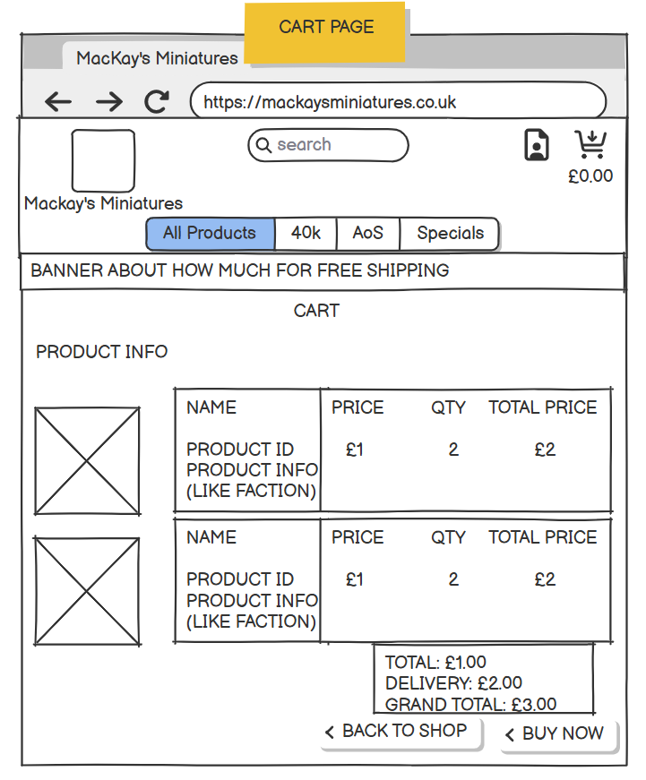

# Mackay's Miniatures
MacKay's Miniatures is a platform that sells and distributes Warhammer Miniatures, for warhammer 40,0000 and Age of Sigmar.
The website will have an easy navigate navbar, and search engine so you can find what you are looking for easily.
An account page will let the users save their details, delivery address and view their previous purchases.


## User Stories 
|Story No.|Story|
| ------------- | ------------- |
|1| As The Site Owner, <br> I want to be users to be able to find what they are looking for with ease <br> So they will be more likely to buy from me <br><br> I know I am done when I have an easy to use NavBar and an effective search engine that allows you to filter out specific items, a gallery style product page and a sorting system |

|2| As the Site Owner, <br> I want to have a site that has secure payment methods <br> So first time and repeat buyers feel comfortable purchasing from me, <br><br> I know I am done when I have a secure payment method that is reliable and looks professional |

|3| As the Site Owner, <br> I want to have an easily identifiable notification on all New Releases and Pre Orderes <br> So potential customers can see what is the newest products and be excited by them <br><br> I know I am done when I have an icon that stands out and identifies the specific product as New or Pre-orderable.|

|4| As A Site user, <br> I want to have a highly understandable way of seeing the effects of my interctions with the site when registering an account, logging in, adding items to my cart, ETC. <br> So I am informed of any information that needs to be presented. <br><br> I know I am done when I have a notification system that will show any information like the above.|

|5| As A returning Customer , <br> I want to be able to see my previous purchases, save my delivery and payment details <br> So I can buy from the provider again with ease and without adding in all the info every time.  <br><br> I know I am done when I have an account system that when logged in will save the delivery address location auto fill. |

|6| As A potential buyer , <br> I want to be able to see whats in my shopping cart and be able to edit them, remove them or increase how many i want <br> So I dont have to navigate away from the buy page to edit what im buying <br><br> I know I am done when i have a page for displaying shopping bag contents and lets me edit what is in it.|

|7| As A buyer , <br> I want to be able to see my invoice information and have it emailed to me for confirmation <br> So I Know my purchase has worked and I have evidence of the products I should recieve <br><br> I know I am done when I have set up an automatic email that will fill in with the buyers information and any contact information for them to be able to contact the owner.|

|8| As A Site user, <br> I want to be able to add new products, edit old products, have only admins be able to do it <br> So I can add new models when they are announced and released, and edit old ones if the information changes <br><br> I know I am done when I have a simple front end page that allows ONLY admin/superusers to make changes, remove and add models and images to the website.|

***

## Wireframes
Below are the designs that I can use to build the site. I have used the user story numbers to link where I can meet the goal in my design. This will help me to think about the users needs as I build the page.

### Home Page Design<br>
User Story Number 1 -  <br>


User Story Number 1 -  <br>


User Story Number 1,3 -  <br>


User Story Number 5,7 -  <br>


User Story Number 2,6 -  <br>


User Story Number 8 -  <br>


User Story Number 4 -  <br>


User Story Number 3,7 -  <br>

***

## Features

### Existing Features

- __Navigation Bar__

  - Links to all pages and is fixed to top
  - resizes for responsive mobile use
  - search bar to search for models
  - account button that links to profile and (for admin) product managment
  - account button changes to sign in/sign up button when not logged in
  - a banner to show how much you need to spend for free delivery


- __Home page__

  - A powerful artwork that shows the theme and setting of some of the models available
  - links to start shopping as a big button 
  - call to action to tell you what the button does


- __Product page__

  - A display of models
  - allows adding to bag from product page
  - has indicator for if its new or pre-order
  - can sort alphabetically by setting, faction, name or price
  - can filter but using nav bar options to only show specific factions/settings


- __Manage Product Page__

  - A form that will add a product to the website
  - will only take valid inputs
  - can supply an image, otherwise a place holder will take over
  - is the same for edit and add, but edit will auto fill with product info


- __Profile Page__

  - Has a form to save delivery info to your account
  - shows a list of old orders and can open up their invoice pages
  - will auto fill the form with data from checkout if save info is checked
  - can update info at any time


- __Shopping Cart__

  - Has info for each model in cart
  - has a cost per model and a calculated total cost based on qty
  - can edit qty and remove any thing from the cart page
  - shows a warning sign for how far way from free shipping you are
  - shows a warning sign if any product is pre orde with a tool tip attached
  - tells you current cost, delivery cost and adds it together for a grand total
  - cart icon on nav bar updates with current cost of cart


- __Check out__

  - a form that will only accept valid info for shipping info
  - a list summary of models in cart and total cost
  - an option to save your currently input information to your profile
  - a stripe secure payment method at will responsivly update to any errors
  - a warning to say how much you will be charged
  - a quick back to cart button if you want to edit anything
  - the warning for pre order models will show here too


- __Invoice Page__

  - A notification of what email address the invoice has been sent to
  - All important information for the invoice will be displayed
  - if logged in with an account when making purchase, can return to this page to check on purchases
  - a toast of the order number and email will pop up too


- __NOTIFICATIONS__

- all useful info pop ups will show up like this


### Features Left to Implement

- 


## Testing

This is a sample of shots of what the site looks like on different devices. 

#### Desktop
|Firefox 128.0.2| Chrome 127.0.6533.72/73 / 23 July 2024|
| ------------- | ------------------ |
|||


| Firefox 128.0.2 medium | Chrome 127.0.6533.72/73 / 23 July 2024 medium |
| ------------- | ------------------ |
|||


| Firefox 128.0.2 small | Chrome 127.0.6533.72/73 / 23 July 2024 small |
| ------------- | ------------------ |
|||

#### Mobile

##### Safari iOS Phone 17.5
| iPhone home page |


### Validator Testing
- HTML
    - home.html: No errors were returned when passing through the official W3C validator [validation]()|<br> 

- CSS 
    - style.css: No errors were returned when passing through offical Jigsaw validator |<br> 

- JS 
    - script.js: No errors were returned when passing through offical Jigsaw validator |<br> 

    - password_validate.js: No errors were returned when passing through offical Jigsaw validator |<br> 

- Python
    - app.py:  No errors were returned when passing through CI Python Linter <br>

### Manual Testing
- I have tested that this page works in different web browsers.
- I have tested that the project is responsive and works with different device sizes. It looks good and functions as normal. 
- I have tested all links, internal and external. They go to the correct destination and open in the correct way. 
- I have tested that all text and fonts are readable and easy to understand.
- I have asked my partner to use the website to see what a first time user would experience.

### Bugs
#### Bug 1
- 

Old code:
```

```
New code:

```

```

### Unfixed Bugs
 -

### User stories Testing
|Story No.|Result|Story/ Evidence|
| ------------- | ------------- | ------------- |
|1|<font color="green"></font> | <br><br> Evidence: <br> |
|2|<font color="green">Test Pass</font> | <br><br> Evidence: <br><br> |
|3|<font color="green"></font> | <br><br> Evidence: <br><br>||
|4|<font color="green"></font> | <br><br> Evidence: <br><br> |
|5|<font color="green"></font> | <br><br> Evidence: <br><br> |

### Accessibility Testing

To check the colors and fonts, I used Lighthouse in the Google devtools. The results are shown below:

| Home  |
| ------- |
|  |

## Deployment

### Cloning & Forking
#### Fork
1. On GitHub.com, navigate to the [SamuelMacKay/mackays-miniature](https://github.com/SamuelMacKay/mackays-miniatures) repository.
2. In the top-right corner of the page, click Fork.
3. By default, forks are named the same as their parent repositories. You can change the name of the fork to distinguish it further.
4. Add a description to your fork.
5. Click Create fork.

#### Clone
1. Above the list of files click the button that says 'Code'.
2. Copy the URL for the repository.
3. Open Terminal. Change the directory to the location where you want the cloned directory.
4. Type git clone, and then paste the URL
5. Press Enter.

### Local Deployment
1. Sign up to [Gitpod](https://gitpod.io/)
2. Download the Gitpod browser extension.
3. On GitHub.com, navigate to the [SamuelMacKay/mackays-miniatures](https://github.com/SamuelMacKay/mackays-miniatures) repository.
4. Above the list of files click the button that says 'Gitpod'.

### Remote Deployment 
 The prgoram was deployed to Heroku. If you have forked/cloned the repository the steps to deploy are:
 1. On Heroku, create a new app.
 2. input a name for your app
 3. Click on the settings tab
 4. Scroll to the Config Vars and click on the "Reveal Config Vars"
 5. Input CREDS into the key field and the content of the Google API creds file into the value area.
 6. Add another config, PORT into key and 8000 into value.
 7. Set the buildbacks to Python and NodeJs in that order .
 8. Link your Heroku app to you repository.
 9. Click on Deploy.
 10. The page will then provide the url to the python terminal.

 The live link can be found here - [mackays-miniatures-sam-m](https://mackays-miniatures-sam-m-29767862f4e8.herokuapp.com/)

## Credits
  
### Content
- Processes from the CI task manager mini project was used to help create this website - [Task-Manager-Mini-Project](https://github.com/Code-Institute-Solutions/TaskManagerAuth/tree/main)

- HTML, CSS and Javascript code help was taken from w3schools - [W3Schools](https://www.w3schools.com/)

### Media

#### Icons
- All page Icons - [Font Awesome](https://fontawesome.com/)
- home page image - [Warhammer Artwork](https://www.goodfon.com/games/wallpaper-download-1920x1120-dark-imperium-warhammer-40-000-box-cover.html)
