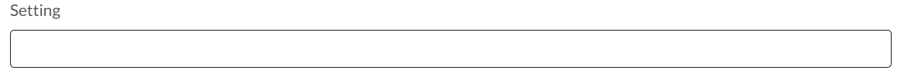
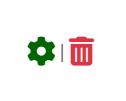

# Mackay's Miniatures Testing

[<< Back to ReadMe](README.md)

### Index
|Test #|Test|Results|Evidence|
| --- | --- | --- | --- |
|1| NavBar resizes on smaller screen sizes |Pass| The Navbar changes from to a mobile friendly version when smaller than 991px
 
 |
|2| Links go to correct pages |Pass| All nav links work when clicked |
|3| Cart updates with current items total costs |Pass| The cart symbol goes green and has the grand total underneath 
 |
|4| Sign Up/Login for unauthenticated users, profile link when logged in |Pass| only shows Profile if user is authenticated, or Sign Up/Log in if not 
 
 |
|5| A search bar to target product by name |Pass| filters products by name, will return partial matches but not incorrect spelling 
 |
|6| Two Call to actions that link to Product pages |Pass| All button links work when clicked 
 |
|7| Responsively resizes depending on screen size |Pass| all buttons remain central and will resize to only occupy up to 60% of the screen width at smallest sizes |

### Products
|Test #|Test|Results|Evidence|
| --- | --- | --- | --- |
|1| Sort by drop down reorganizes product display order based on option clicked |Pass| each option works when clicked and reforms the products
|
|2| Product layout displays 1,2,3 or 4 in a row on small, medium, large and xlarge |Pass| layout resizes responsively when on mobile, tablet or desktop 
 
 
 
 |
|3| Can add models to cart straight from the main product page |Pass| a quantity selector allows you to add multiple, which has + and - buttons to adjust for UX and an add to cart button that will automatically update the current cart total on the nav bar 
 
 |
|4| Each product image links to its product detail page |Pass| Links were checked by clicking on them |
|5| A total product showing counter |Pass| updates the number based on the total amount on the page
 |
|6| a fixed button on the bottom right corner links back to top for mobile UX |Pass| Links were checked by clicking on them
 |
|7| PreOrder and New notifications on products are links to all pre order or new products |Pass| Links were checked by clicking on them
 |
|1| The product faction is a link to filter out just that faction |Pass| Links were checked by clicking on them |

### Add Products
|Test #|Test|Results|Evidence|
| --- | --- | --- | --- |
|1| A drop down with all possible faction options to select, and starts filled in, so it cannot be set to empty |Pass|  checked by clicking the drop down and adding a new test faction that shows up, and is removed when deleted
 |
|2| Two options to flag the product as new or pre-order |Pass| checked by clicking them, can be added to the same product at the same time, and will add them to the pre order/new filters on the product page
 |
|3| is a mandatory input, and has an unlimited amount of max characters for the longer, more detailed descriptions |Pass| checked by attempting to add a product with out it, and then adding lorem ipsum for an unrealistic length, it also has a * for ux  
 |
|4| is not mandatory and will auto set a default image if one is not chosen |Pass| tested by adding a product with no image |
|5| Select image button opens local image folder for manual image upload |Pass| Checked by clicking on it, and selected image is then uploaded to AWS database and used as the product image |
 |
|6| Cancel links to product page |Pass| Links were checked by clicking on them |
|7| Add product updates the product database with the new entry |Pass| Links were checked by clicking on them 
 |
|8| Is mandatory to have something in here |Pass| checked by adding product with out a name and it flagged this field as necessary, it also has a * for ux
 |
|9| Is a mandatory field, and only accepts numerical inputs |Pass| Checked by typing in the field and adding non-numerical characters, it also has a * for ux 
|10| Only allows whole numbers, or up to 2 decimal places |Pass| throws a validation alert that you have too many decimals, and will still display 2 decimal places on the product if only a full number is input |
 |
|11| A manual input for the models setting, is mandatory |Pass| Checked by adding product with out it and it flagged the field. Scope to add a drop down option for setting like unit type or faction
 |
|12| A manual input to assign an SKU number to a product, Cannot be left blank |Pass| checked by trying to add with out it, and it flags the field as mandatory. Scope to have the SKU number be auto generated based on product faction, setting and unit type
 |
|13| A drop down with all unit type options available to select |Pass| Checked by clicking on them |
|14| Is it a mandatory field that only allows the list of unit types to be used? |Pass| it was allowing a blank input, which would set it to None on the product page, i removed the null and blank being set to true, now attempting to add without changing it from the ------- default flags the field as needing an input 
 |

### Edit Products
|Test #|Test|Results|Evidence|
| --- | --- | --- | --- |
|1| set image is not mandatory and will auto set a default image if one is not chosen |Pass| tested by adding a product with no image |
|2| Select image button opens local image folder for manual image upload |Pass| Checked by clicking on it, and selected image is then uploaded to AWS database and used as the product image |
|3| Displays current set image as a small preview |Pass| Checked by changing the image and it updates when returning to that edit page 
 |
|4| Cancel links to product page |Pass| Links were checked by clicking on them |
|5| Update product updates the product database with the new information |Pass| Links were checked by clicking on them 
 |
|6| Form auto fills with selected products information |Pass| checked by opening different products to edit |
|7| All other features of the form are identical to the add product age |Pass| all validations remain the same when comparing the two
 |

### Product Details
|Test #|Test|Results|Evidence|
| --- | --- | --- |--- |
|1| An edit(links to edit_product page) or delete button that only shows up for admin |Pass| Checked by being a non-super user and not signed in and it wasn't there. Links were checked by clicking on them
 |
|1| A link that sends you to a filtered product page for that faction |Pass| Links were checked by clicking on them
 |
|1| Link to a new tab with the URL and of the picture |Pass| Links were checked by clicking on them, correctly opens new tab, rather than redirecting current page
 |
|1| + and - adds/reduces the number shown, and when add to bag is clicked, it adds that amount to the cart |Pass| Buttons were checked by clicking on them, the total shown in the top right corner responsively updates to that information |
|1| Keep shopping button Links back to the product page |Pass| Links were checked by clicking them 
 |

### Cart
|Test #|Test|Results|Evidence|
| --- | --- | --- |--- |
|1| Displays image of the associated product |Pass| checked by adding multiple different items to cart 
 |
|1| A Keep shopping button that links back to the product page |Pass| Links were checked by clicking on them |
|1| Secure checkout button links to a Checkout page |Pass| Links were checked by clicking on them, displays a lock to imply security for UX
 |
|1| If your cart is empty, a line saying it is empty and a keep shopping button will appear |Pass| checked by going to cart with no items added, and then adding 1 product and returning. Also deleting the last product in your cart will also bring this up.
 |
|1| A total cost sum that passes a % based delivery cost |Pass| checked by adding less than the free shipping threshold to cart |
|1| A bright banner will appear to inform you how far off of free shipping you are, and disappears when you reach the threshold |Pass| Checked by having less than, and then more than the threshold in the cart |
|1| Grand total is calculated automatically based on all products in cart, and current shipping fee, if there is one |Pass| checked by manually adding up the cost to compare it to the final result shown
 |
|1| A list of all the product info is displayed in an easy to read layout |Pass| checked by adding different products and checking they all line up to their product image
 |
|1| Allows for quick editing of the cart if the user changes their mind, can add, reduce or remove products entirely with out having to navigate away from the cart page |Pass| links were checked by clicking on them 
 |

### Checkout
|Test #|Test|Results|Evidence|
| --- | --- | --- |--- |
|1| |Pass|  |

### Checkout Success
|Test #|Test|Results|Evidence|
| --- | --- | --- |--- |
|1| |Pass|  |

### Sign up
|Test #|Test|Results|Evidence|
| --- | --- | --- |--- |
|1| Link to Log in Page at the top of form |Pass| Links were checked by clicking on them 
 |
|2| A form that needs to be valid to be passed through and allow you to sign up |Pass| all validation violations are explained and working as intended, was tested by trying all wrong ways to create an account 
|
|3| sign up button sends a confirmation email to the valid email address to confirm sign up |Pass| Links were checked by clicking on them, validation email arrives very quickly 
 |

### Log in
|Test #|Test|Results|Evidence|
| --- | --- | --- |--- |
|1| Link to sign up page at the top of form |Pass| Links were checked by clicking on them 
 |
|2| verifies a valid log in attempt, if the user name exists and if password is correct |Pass| Link was checked by clicking log in, also shows error message if username or password was incorrect, but for security doesn't specify which is incorrect
 |
|3| Forgot Password link to a reset password page |Pass| Link was checked by clicking them
 |
|4| Log in form that only accepts accurate log in attempts with users that are verified and exist |Pass| failed attempts will bring you back to the log in page, with notification saying username or password was incorrect

 |
|5| Reset password form validates a valid email address |Pass| only sends an email if the email address follows a regular email address pattern 
 |
|6| Link back to Log in page |Pass| Links were checked by clicking them |

|7| If valid email address, will send a reset password link to that email address |Pass| Links were checked by clicking them |

### Profile
|Test #|Test|Results|Evidence|
| --- | --- | --- |--- |
|1| The user profile form will store the information to be used for checkout |Pass| checked by getting to checkout step, all given info auto fills in that form, and will update if it is changed at the profile page
 |
|2| links to a receipt page for that order |Pass|  links were checked by clicking them
 |
|3| Shows all previous orders from most recent |Pass| checked by making a complete order, and it updated with a new order line
 |

### Order History
|Test #|Test|Results|Evidence|
| --- | --- | --- |--- |
|1| Displays all given information from the order, if the user was authenticated and logged in when they completed the purchase |Pass|  
 |
|2| Links back to the profile page |Pass| links were checked by clicking on them
 |
|3| a pop up toast will appear to inform the user they are looking at an old/past order receipt |Pass| checked by clicking link, and saw it popped up when the page loaded 
 |