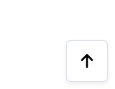

# Mackay's Miniatures Testing

[<< Back to ReadMe](README.md)

### Index
|Test #|Test|Results|Evidence|
| --- | --- | --- |--- |
|1| NavBar resizes on smaller screen sizes |Pass| The Navbar changes from to a mobile friendly version when smaller than 991px
 
 |
|2| Links go to correct pages |Pass| All nav links work when clicked |
|3| Cart updates with current items total costs |Pass| The cart symbol goes green and has the grand total underneath 
 |
|4| Sign Up/Login for unauthenticated users, profile link when logged in |Pass| only shows Profile if user is authenticated, or Sign Up/Log in if not 
 
 |
|5| A search bar to target product by name |Pass| filters products by name, will return partial matches but not incorrect spelling 
 |
|6| Two Call to actions that link to Product pages |Pass| All button links work when clicked 
 |
|7| Responsively resizes depending on screen size |Pass| all buttons remain central and will resize to only occupy up to 60% of the screen width at smallest sizes |

### Products
|Test #|Test|Results|Evidence|
| --- | --- | --- |--- |
|1| Sort by drop down reorganizes product display order based on option clicked |Pass| each option works when clicked and reforms the products
|
|2| Product layout displays 1,2,3 or 4 in a row on small, medium, large and xlarge |Pass| layout resizes responsively when on mobile, tablet or desktop 
 
 
 
 |
|3| Can add models to cart straight from the main product page |Pass| a quantity selector allows you to add multiple, which has + and - buttons to adjust for UX and an add to cart button that will automatically update the current cart total on the nav bar 
 
 |
|4| Each product image links to its product detail page |Pass| Links were checked by clicking on them |
|5| A total product showing counter |Pass| updates the number based on the total amount on the page
 |
|6| a fixed button on the bottom right corner links back to top for mobile UX |Pass| Links were checked by clicking on them
 |
|7| PreOrder and New notifications on products are links to all pre order or new products |Pass| Links were checked by clicking on them
 |
|1| The product faction is a link to filter out just that faction |Pass| Links were checked by clicking on them |

### Add Products
|Test #|Test|Results|Evidence|
| --- | --- | --- |--- |
|1| |Pass|  |

### Edit Products
|Test #|Test|Results|Evidence|
| --- | --- | --- |--- |
|1| |Pass|  |

### Product Details
|Test #|Test|Results|Evidence|
| --- | --- | --- |--- |
|1| |Pass|  |

### Cart
|Test #|Test|Results|Evidence|
| --- | --- | --- |--- |
|1| |Pass|  |

### Checkout
|Test #|Test|Results|Evidence|
| --- | --- | --- |--- |
|1| |Pass|  |

### Checkout Success
|Test #|Test|Results|Evidence|
| --- | --- | --- |--- |
|1| |Pass|  |

### Sign up
|Test #|Test|Results|Evidence|
| --- | --- | --- |--- |
|1| Link to Log in Page at the top of form |Pass| Links were checked by clicking on them 
 |
|2| A form that needs to be valid to be passed through and allow you to sign up |Pass| all validation violations are explained and working as intended, was tested by trying all wrong ways to create an account 
|
|3| sign up button sends a confirmation email to the valid email address to confirm sign up |Pass| Links were checked by clicking on them, validation email arrives very quickly 
 |

### Log in
|Test #|Test|Results|Evidence|
| --- | --- | --- |--- |
|1| Link to sign up page at the top of form |Pass| Links were checked by clicking on them 
 |
|2| verifies a valid log in attempt, if the user name exists and if password is correct |Pass| Link was checked by clicking log in, also shows error message if username or password was incorrect, but for security doesn't specify which is incorrect
 |
|3| Forgot Password link to a reset password page |Pass| Link was checked by clicking them
 |
|4| Log in form that only accepts accurate log in attempts with users that are verified and exist |Pass| failed attempts will bring you back to the log in page, with notification saying username or password was incorrect

 |
|5| Reset password form validates a valid email address |Pass| only sends an email if the email address follows a regular email address pattern 
 |
|6| Link back to Log in page |Pass| Links were checked by clicking them |

|7| If valid email address, will send a reset password link to that email address |Pass| Links were checked by clicking them |

### Profile
|Test #|Test|Results|Evidence|
| --- | --- | --- |--- |
|1| The user profile form will store the information to be used for checkout |Pass| checked by getting to checkout step, all given info auto fills in that form, and will update if it is changed at the profile page
 |
|2| links to a receipt page for that order |Pass|  links were checked by clicking them
 |
|3| Shows all previous orders from most recent |Pass| checked by making a complete order, and it updated with a new order line
 |

### Order History
|Test #|Test|Results|Evidence|
| --- | --- | --- |--- |
|1| Displays all given information from the order, if the user was authenticated and logged in when they completed the purchase |Pass|  
 |
|2| Links back to the profile page |Pass| links were checked by clicking on them
 |
|3| a pop up toast will appear to inform the user they are looking at an old/past order receipt |Pass| checked by clicking link, and saw it popped up when the page loaded 
 |